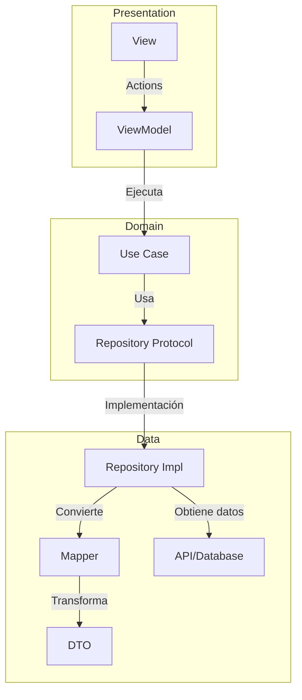
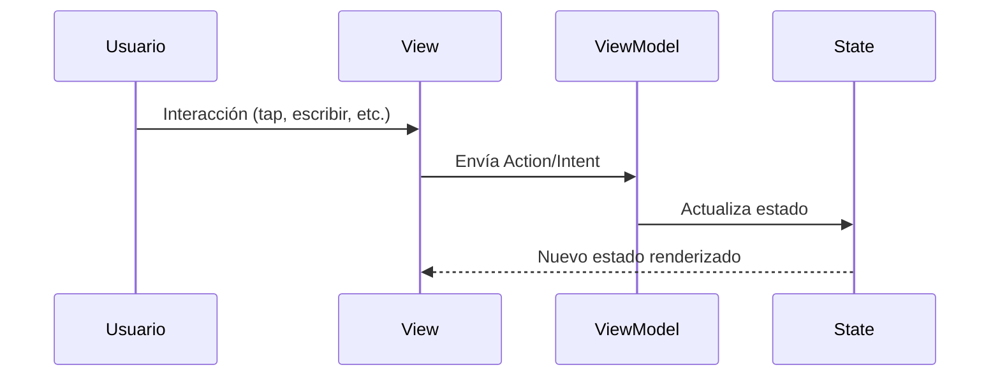
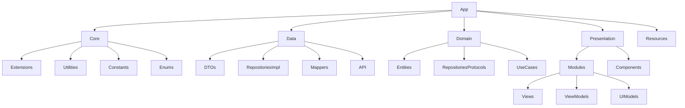
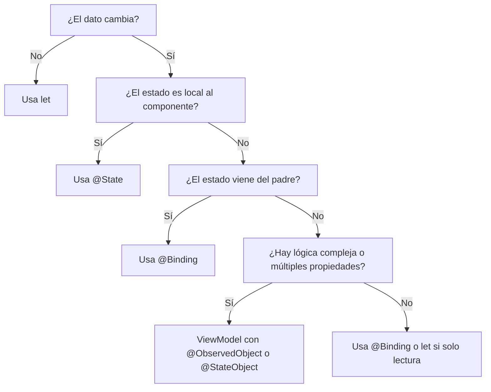
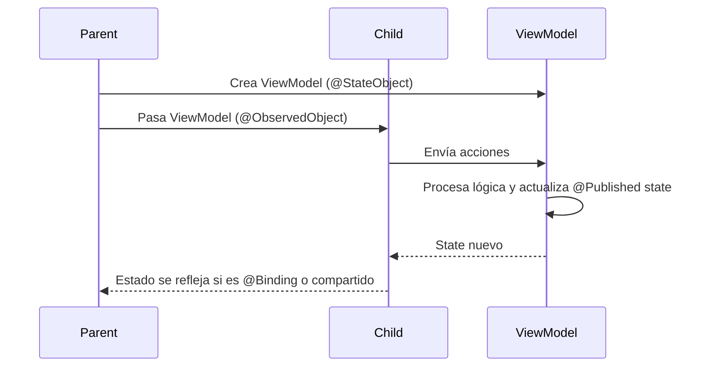

# EnChinga
App for local deliveries.

## Clean Architecture + Repository Pattern

```mermaid
graph TD
    A[View] -->|Actions| B[ViewModel]
    B -->|Ejecuta| C[Use Case]
    C -->|Usa| D[Repository Protocol]
    D -->|Implementación| E[Repository Impl]
    E -->|Convierte| F[Mapper]
    F -->|Transforma| G[DTO]
    E -->|Obtiene datos| H[API/Database]

    subgraph Presentation
        A
        B
    end
    
    subgraph Domain
        C
        D
    end
    
    subgraph Data
        E
        F
        G
        H
    end
```

## Flujo MVVM + UDF

```mermaid

sequenceDiagram
    participant U as Usuario
    participant V as View
    participant VM as ViewModel
    participant S as State
    
    U->>V: Interacción (tap, escribir, etc.)
    V->>VM: Envía Action/Intent
    VM->>S: Actualiza estado
    S-->>V: Nuevo estado renderizado


```

## File Structure

```mermaid
graph TD
    App --> Core
    App --> Presentation
    App --> Domain
    App --> Data
    App --> Resources

    Core --> Extensions
    Core --> Utilities
    Core --> Constants
    Core --> Enums

    Data --> DTOs
    Data --> RepositoriesImpl
    Data --> Mappers
    Data --> API

    Domain --> Entities
    Domain --> RepositoriesProtocols
    Domain --> UseCases

    Presentation --> Modules
    Presentation --> Components

    Modules --> Views
    Modules --> ViewModels
    Modules --> UIModels

```

## Databinding

```mermaid

flowchart TD
    A[¿El dato cambia?] -->|No| B[Usa let]
    A -->|Sí| C[¿El estado es local al componente?]
    C -->|Sí| D["Usa @State"]
    C -->|No| E[¿El estado viene del padre?]
    E -->|Sí| F["Usa @Binding"]
    E -->|No| G[¿Hay lógica compleja o múltiples propiedades?]
    G -->|Sí| H["ViewModel con @ObservedObject o @StateObject"]
    G -->|No| I["Usa @Binding o let si solo lectura"]


```

## Lifecycle of viewModel

```mermaid

sequenceDiagram
    participant Parent
    participant Child
    participant VM as ViewModel

    Parent->>VM: Crea ViewModel (@StateObject)
    Parent->>Child: Pasa ViewModel (@ObservedObject)
    Child->>VM: Envía acciones
    VM->>VM: Procesa lógica y actualiza @Published state
    VM-->>Child: State nuevo
    Child-->>Parent: Estado se refleja si es @Binding o compartido
```
